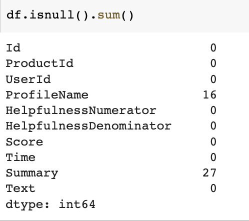
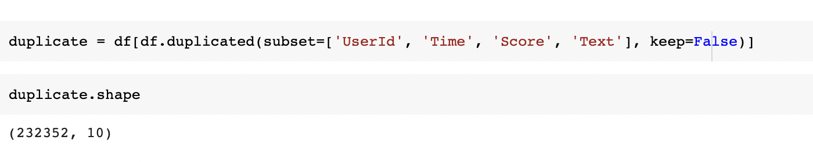
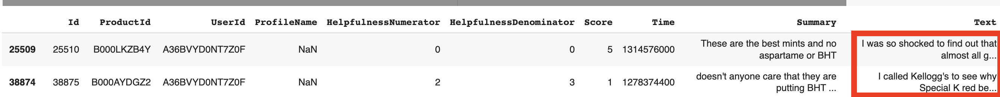
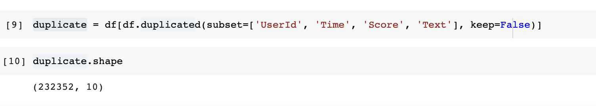
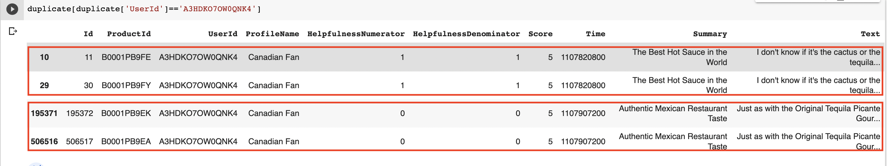
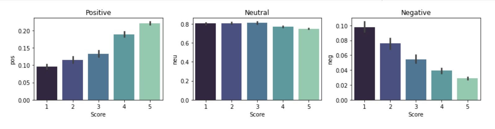

# Sentiment Analysis of Amazon Fine Food Reviews

## Team Members: 
Devna Ramesh, Kratika Shetty

## Background and Motivation
To perform Sentiment Analysis of Amazon Fine Food Reviews and compare the performance of two Models - VADER and Roberta Base Model.

## Dataset
### Amazon Fine Food Reviews
This dataset consists of reviews of fine foods from amazon. The data span a period of more than 10 years, including all ~500,000 reviews up to October 2012. Reviews include product and user information, ratings, and a plain text review. It also includes reviews from all other Amazon categories.

Reviews from Oct 1999 - Oct 2012
 * 568,454 reviews
 * 256,059 users
 * 74,258 products
 * 260 users with > 50 reviews

### Columns

| Column |Description|
|-------|--------|
| Id | Unique identifier for each of the review |
| ProductId | Unique identifier for the product | 
| UserId | Unique identifier for the user |
| ProfileName | Profile name of User |
| HelpfulnessNumerator | Number of users who found review helpful | 
| HelpfulnessDenomitaor | Number of users who indicated whether they found the review helpful or not | 
| Score | Rating between 1 to 5 |
| Time | Timestamp of the review |
| Summary |  Brief summary of the review |
| Text | Text of the review |

## Data Preprocessing

Checking for Null Values - 

  

Inspecting Null Values -
We observed that records have text populated when Summary is Null. When ProfileName is null, UserID is populated. In both the cases, the reviews are relevant to the dataset. Since these reviews could be uniquely identified, we did not drop records with null values.

  

  

Checking for Duplicate Values - 

  

Inspecting Duplicate Values Further -

  

Reviews with the same UserId, Review and Score posted at the same time can be considered as duplicates. There are rows duplicated for the same product ID and there are reviews which have different product ID. Reviews with different product ID posted at the same time can be considered as duplicates as review that is published for a version of prodcut is reproduced for every other variety in the products.

## Exploratory Data Analysis

We can observe that a significant number of reviews are 5 stars.

 

## VADER

VADER - Valence Aware Dictionary and sEntiment Reasoner. VADER is a type of sentiment analysis that relies on lexicons of sentiment-related words. Every word in the lexicon is evaluated using this process to determine if it is positive or negative and, if so, how +ve or -ve.

When VADER looks at a piece of text, it checks to see whether any of the terms are recognized in the lexicon. For instance in the sentence, "The food is fantastic, and the environment is awesome", the terms "amazing" and "great" are present in the lexicon with score of 1.9 and 1.8 respectively.

VADER generates four sentiment metrics - +ve, neutral, -ve and compound score.

The Compound score is a metric that calculates the sum of all the lexicon ratings which have been normalized between -1(most extreme negative) and +1 (most extreme positive).

## Twitter-roBERTa-base Model

Twitter-roBERTa-base for Sentiment Analysis - This is a roBERTa-base model trained on ~58M tweets and finetuned for sentiment analysis with the TweetEval benchmark. This model is suitable for English.

RoBERTa is a transformers model pretrained on a large corpus of English data in a self-supervised fashion. This means it was pretrained on the raw texts only, with no humans labeling them in any way (which is why it can use lots of publicly available data) with an automatic process to generate inputs and labels from those texts. More precisely, it was pretrained with the Masked language modeling (MLM) objective. 

Taking a sentence, the model randomly masks 15% of the words in the input then runs the entire masked sentence through the model and has to predict the masked words. This is different from traditional recurrent neural networks (RNNs) that usually see the words one after the other, or from autoregressive models like GPT which internally mask the future tokens. It allows the model to learn a bidirectional representation of the sentence. This way, the model learns an inner representation of the English language that can then be used to extract features useful for downstream tasks: if you have a dataset of labeled sentences, for instance, you can train a standard classifier using the features produced by the BERT model as inputs.

## Results

Senitmental analysis was performed on 5000 records due to performance issues in Roberta Model. Here we can assume that reviews with low scores are mostly negative and reviews with hgiher scores are mostly positive. 

Vader Result -

 

In VADER results, most of the reviews with low scores are identified as negative where as most of the reviews with higher scores are identified as positive.

### Comparsion Between the Models

RoBERTa-base model has identified positive reviews with 5 scores more confidently. In RoBERTa model, the reviews with 5 scores is assigned higher positivity score as compared to that of VADER model. Most of the lesser star reviews are very low in positivity.

  

## GitHub Repository -  

Here is the link for the [repository](https://github.com/kratikashetty/Sentiment-Analysis/blob/main/src/Senitment_Analysis.ipynb) 

### References
1. https://www.kaggle.com/code/khyatigajera/amazon-food-reviews

