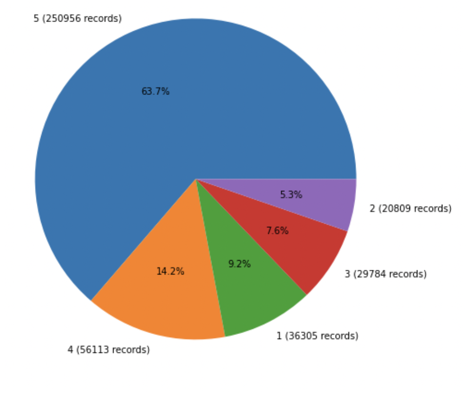

# Sentiment Analysis of Amazon Fine Food Reviews

## Team Members: 
Devna Ramesh, Kratika Shetty

## Background and Motivation
To perform Sentiment Analysis of Amazon Fine Food Reviews and compare the performance of two Model - VADER and Roberta Base Model.

VADER - Valence Aware Dictionary and sEntiment Reasoner. VADER is a type of sentiment analysis that relies on lexicons of sentiment-related words. Every word in the lexicon is evaluated using this process to determine if it is positive or negative and, if so, how +ve or -ve.

When VADER looks at a piece of text, it checks to see whether any of the terms are recognized in the lexicon. For instance in the sentence, "The food is fantastic, and the environment is awesome", the terms "amazing" and "great" are present in the lexicon with score of 1.9 and 1.8 respectively.

VADER generates four sentiment metrics - +ve, neutral, -ve and compound score.

The Compound score is a metric that calculates the sum of all the lexicon ratings which have been normalized between -1(most extreme negative) and +1 (most extreme positive).

Twitter-roBERTa-base for Sentiment Analysis - This is a roBERTa-base model trained on ~58M tweets and finetuned for sentiment analysis with the TweetEval benchmark. This model is suitable for English.

RoBERTa is a transformers model pretrained on a large corpus of English data in a self-supervised fashion. This means it was pretrained on the raw texts only, with no humans labeling them in any way (which is why it can use lots of publicly available data) with an automatic process to generate inputs and labels from those texts. More precisely, it was pretrained with the Masked language modeling (MLM) objective. 

Taking a sentence, the model randomly masks 15% of the words in the input then runs the entire masked sentence through the model and has to predict the masked words. This is different from traditional recurrent neural networks (RNNs) that usually see the words one after the other, or from autoregressive models like GPT which internally mask the future tokens. It allows the model to learn a bidirectional representation of the sentence. This way, the model learns an inner representation of the English language that can then be used to extract features useful for downstream tasks: if you have a dataset of labeled sentences, for instance, you can train a standard classifier using the features produced by the BERT model as inputs.

## Dataset
### Amazon Fine Food Reviews
This dataset consists of reviews of fine foods from amazon. The data span a period of more than 10 years, including all ~500,000 reviews up to October 2012. Reviews include product and user information, ratings, and a plain text review. It also includes reviews from all other Amazon categories.

Reviews from Oct 1999 - Oct 2012
 * 568,454 reviews
 * 256,059 users
 * 74,258 products
 * 260 users with > 50 reviews

### Columns

| Column |Description|
|-------|--------|
| Id | Unique identifier for each of the review |
| ProductId | Unique identifier for the product | 
| UserId | Unique identifier for the user |
| ProfileName | Profile name of User |
| HelpfulnessNumerator | Number of users who found review helpful | 
| HelpfulnessDenomitaor | Number of users who indicated whether they found the review helpful or not | 
| Score | Rating between 1 to 5 |
| Time | Timestamp of the review |
| Summary |  Brief summary of the review |
| Text | Text of the review |
 

## Exploratory Data Analysis

A ventilator must consider lung attributes Capacitance (C) and Resistance(R) to predict the optimal pressure.

R can be thought of as the resistance observed while blowing up a balloon through a straw. Higher R will have more resistance and it will be harder to let air inside.

 

C can be thought of as the thickness of the balloon’s latex, the one with higher C will have thinner latex and it would be easier to let air in.

 

### Analysis of pressure, u_in and u_out with respect to time_step

  
   
  

### Plot of pressure, u_in and u_out for breath_id = 1

It is evident from below that u_out is zero during the inhalation and 1 during the exhalation.

  

### Distribuition of Pressure

Variation of pressure is more during the inhalation phase of the breath.

  
   

### R and C values present in the Dataset

There are three unique values for R and C each.

  

Plot of pressure across different combination of R & C for different Breath IDs is shown below. We can infer from below that pressure is dependent on the values of R and C.

   

## Feature Engineering

Pressure is a function of past valve settings: p[i] = f(u_in[:i]). But u_in is not an independent variable, u_in is the output of a controller, and the inputs of the controller are the past measured pressures: u_in[i] = g(p[:i+1]). Hence in order to get data from previous time steps data was preprocessed as follows. Following features were added - 

 * New Lag features for u_in
 * Exponential Moving Mean, Standard Deviation and correlation of u_in for each breath ID 
 * Rolling Mean, Standard Deviation and Maximum of u_in for each breath. Here the size of the moving window is 10
 * Expanding Mean, Standard Deviation and Maximum of u_in for each breath ID where size of minimum period is 2
 * R and C after converting into indicator variables

## Implementation

Since we are using a Dataset from a kaggle competition, we were unable to to get the true Y values for the test data. We split the trainng data as follows to get the training and test data - 

**Training Data** 70% of the Total Breath IDs = 52,815 Breath IDs

**Test Data** 30% of the Total Breath IDs = 22,635 Breath IDs

### XGBOOST Using XGBRegressor

XGBoost was first considered for modeling the training data since it can be used for regression predictive modeling. We also used repeated 5-fold cross-validation to evaluate and pressure was found out by averaging pressure across multiple runs. After the training data fit into the XGBoost model, the result is generated shown below:

  

**Feature Importance** Feature Importance provides a score that indicates how useful or valuable each feature was in the construction of the boosted decision trees within the model. Here, the features are automatically named according to their index in the input array. Columns id, time_step and u_out have the top three importance score. 

  
 

Here top 3 features fO, f2, f5 corresponds to id, time_step and u_out.

### Bi-LSTM Model 

Stacked Bi-LSTMs Model was implemented in Keras. Bidirectional Long Short-Term Memory (Bi-LSTM) networks was implemented as they are capable of learning order dependence in sequence prediction problems. LSTM networks are well-suited to classifying, processing and making predictions based on time series data.

5-fold cross validation was performed and avaerage pressure was calculated after 5 runs.

Model parameters - 
 * Bi-LSTM - 4 Layers
 * 2 Dense Layers in the output layer with ReLu activation

Following Mean Absolute Error, R-squared and Mean Squared Error were obtained - 

  

## Conclusion

1. Bi-LSTM Model performed  better than Xgboost.
2. MAE and MSE of Bi-LSTM model was better than that of Xgboost

| | Bi-LSTM |XGBoost|
|-------|--------|--------|
| Mean Squared Error | 0.1403 | 0.4471 |
| Mean Absolute Error | 0.1903 | 0.387 |

4. Good scores were obtained with 3 to 5 layers Bi-LSTM layers.

## GitHub Repository -  

Here is the link for the [repository](https://github.com/anamika1302/CS539-Ventilator-Pressure-Prediction) 

### References
1. https://machinelearningmastery.com/xgboost-for-time-series-forecasting/
2. https://www.kaggle.com/theoviel/deep-learning-starter-simple-lstm 
3. https://medium.com/geekculture/10-hyperparameters-to-keep-an-eye-on-for-your-lstm-model-and-other-tips-f0ff5b63fcd4
4. https://www.kaggle.com/ranjeetshrivastav/ventilator-pressure-prediction-xgboost/notebook
